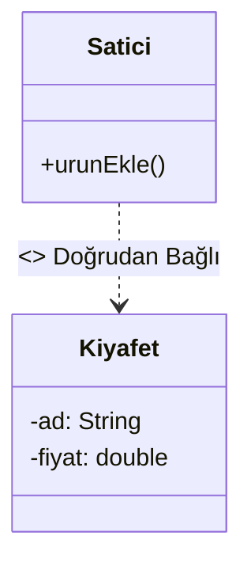
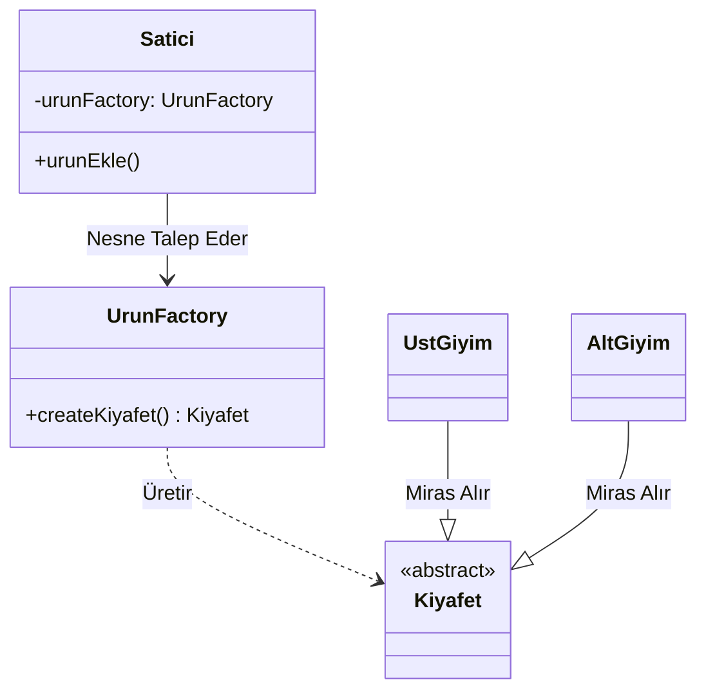
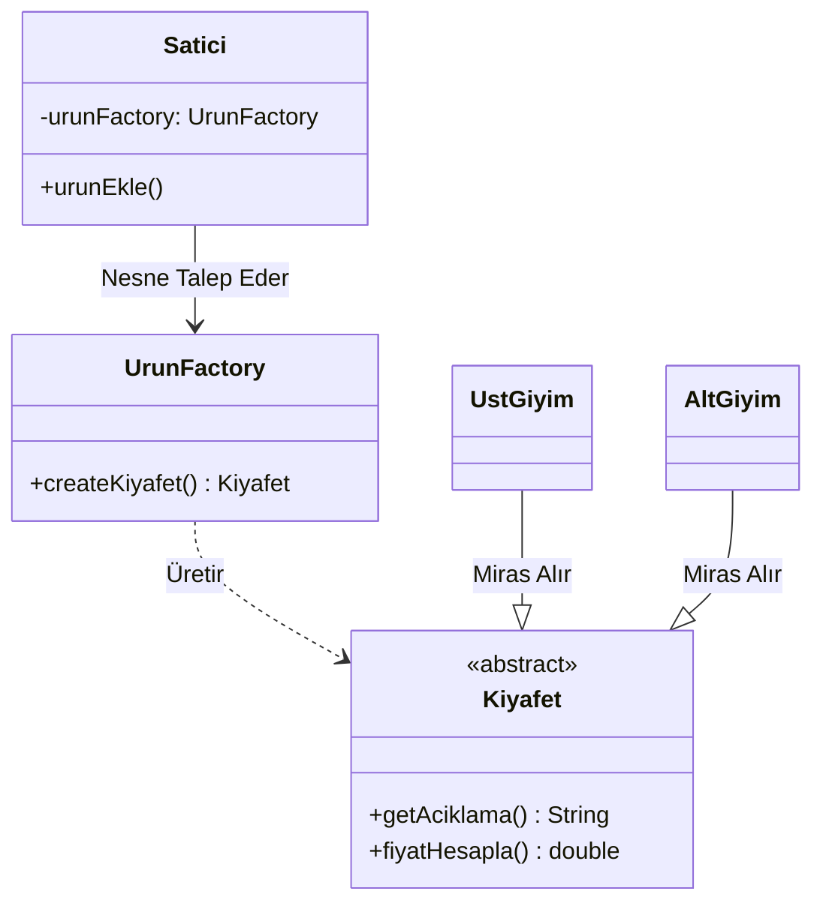
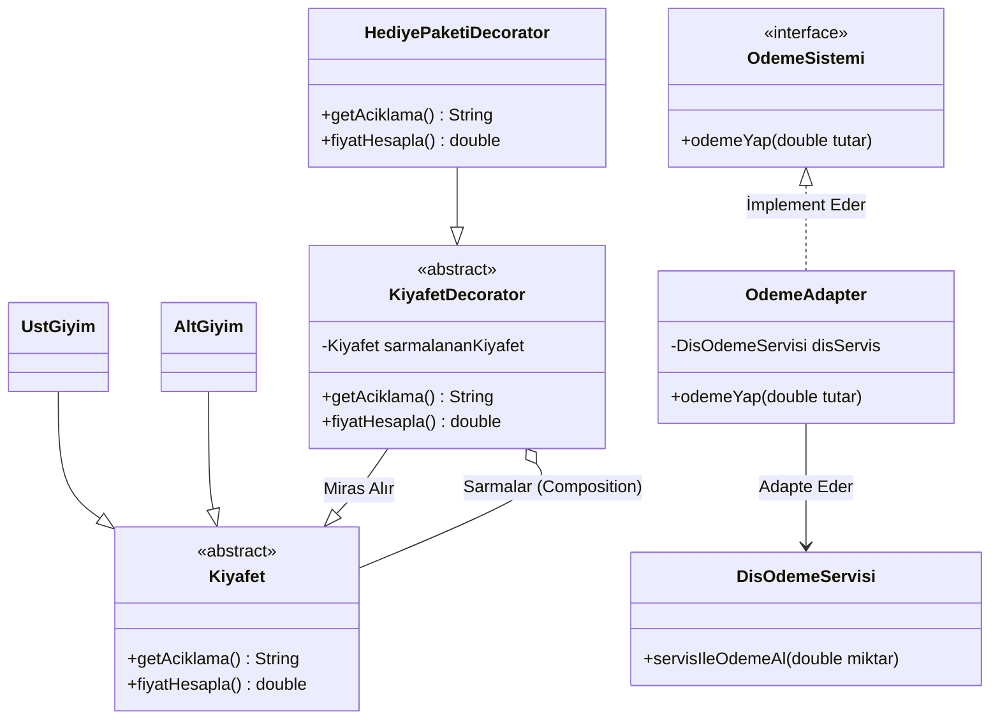

# Tasarım Örüntüleri Uygulama Günlüğü

Bu dosya, projenin ilerleyen fazlarında sisteme dahil edilecek olan tasarım örüntülerinin seçim gerekçelerini ve uygulama detaylarını içermektedir.

## Faz: 0
Şu anda herhangi bir tasarım örüntüsü kullanılmamıştır. Sistem "Spaghetti Code" yapısında, tüm mantığın tek bir sınıf ve metod içinde toplandığı bir haldedir.

## 1. Nesne Oluşturma Örüntüleri (Creational Patterns)
*  **Hedef:** İndirim stratejilerini veya farklı ürün tiplerini oluştururken esneklik sağlamak.
## 2. Yapısal Örüntüler (Structural Patterns)
*  **Hedef:** Farklı indirim türlerini veya ek hizmetleri (kargo, hediye paketi vb.) ana kodu bozmadan birbirine eklemek.
## 3. Davranışsal Örüntüler (Behavioral Patterns)
*  **Hedef:** Sepetteki indirim hesaplama mantığını (Strategy Pattern gibi) dinamik hale getirmek ve if-else yığınlarından kurtulmak.

## Faz: 1 - Factory Method Örüntüsü

#### 1. Nerede Kullandınız?
Bu örüntüyü sistemin ürün oluşturma (nesne yaratma) aşamasında uyguladım. Satici sınıfı içinde bulunan ve doğrudan nesne üreten mantığı, yeni oluşturduğum UrunFactory sınıfına taşıyarak merkezi bir üretim noktası oluşturdum.

#### 2. Neden Kullandınız?
Faz 0'da Satici sınıfı, UstGiyim ve AltGiyim gibi somut sınıflara doğrudan bağlıydı (**Tight Coupling**). Bu durum, her yeni ürün tipi eklendiğinde Satici sınıfının kodunu değiştirmeyi zorunlu kılıyordu. Nesne yaratma sorumluluğunu bir fabrikaya devrederek sınıflar arası bağımlılığı azaltmak ve sistemi genişletilebilir hale getirmek için bu örüntüyü seçtim.

#### 3. Ne Kazandınız?
* **Gevşek Bağlılık (Loose Coupling):** Satici ve ShoppingCart sınıfları artık ürünlerin nasıl yaratıldığıyla ilgilenmiyo, sadece fabrikadan ürün talep ediyor.
* **Polimorfizm:** Tüm ürünler Kiyafet üst sınıfı üzerinden işleme alınarak kodun esnekliği artırıldı.
* **Bakım Kolaylığı:** Ürün oluşturma mantığında yapılacak bir değişiklik artık tüm sınıflarda değil, sadece UrunFactory içinde tek bir noktada yapılmaktadır.

---

### Önce/Sonra UML Sınıf Diyagramı

### Faz 0 (Öncesi) :

### Faz 1 (Sonrası) :

### **Faz 2: Structural Patterns (Yapısal Örüntüler)**

Bu aşamada, mevcut sınıfların yapısını bozmadan sisteme yeni yetenekler ve dış servisler kazandırmak amacıyla iki farklı yapısal örüntü kullanılmıştır.

#### **1. Decorator Pattern (Süsleyici Örüntüsü)**
* **Kullanım Amacı:** Ürün sınıflarının (Kıyafet, Pantolon vb.) koduna müdahale etmeden, çalışma anında bu ürünlere "Hediye Paketi" gibi opsiyonel özellikler ve ek maliyetler eklemek.
* **Neden Tercih Edildi?** Her özellik kombinasyonu için ayrı alt sınıflar oluşturup "Sınıf Patlaması" (Class Explosion) yaratmak yerine, mevcut nesneyi sarmalayarak (wrapping) esnek bir yapı kurulmuştur.
* **Uygulama:** KiyafetDecorator soyut sınıfı üzerinden türetilen HediyePaketiDecorator sınıfı, orijinal kıyafet nesnesini içinde tutarak hem fiyatı hem de açıklamayı dinamik olarak genişletir.

#### **2. Adapter Pattern (Adaptör Örüntüsü)**
* **Kullanım Amacı:** Projeye dahil edilen harici DisOdemeServisi'nin metod isimlerini, mevcut ödeme sistemimizle (odemeYap() metodu) konuşabilir hale getirmek.
* **Neden Tercih Edildi?** Dışarıdan gelen servis koduna müdahale edilemediği durumlarda, mevcut sistemdeki arayüzleri bozmadan uyum sağlamanın en güvenli yolu olduğu için seçilmiştir.
* **Uygulama:** OdemeAdapter sınıfı, dış servisin servisIleOdemeAl() metodunu sarmalayarak sistemimizin beklediği arayüz üzerinden çalışmasını sağlar.

### **UML Diyagramı Güncellemesi**

#### **Faz 1 (Öncesi) :**

#### ** Faz 2 (Sonrası) :**

