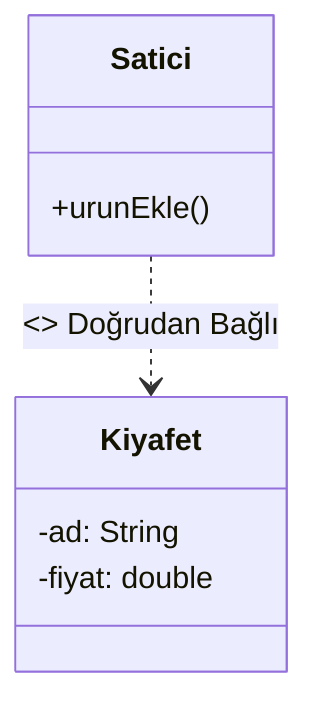
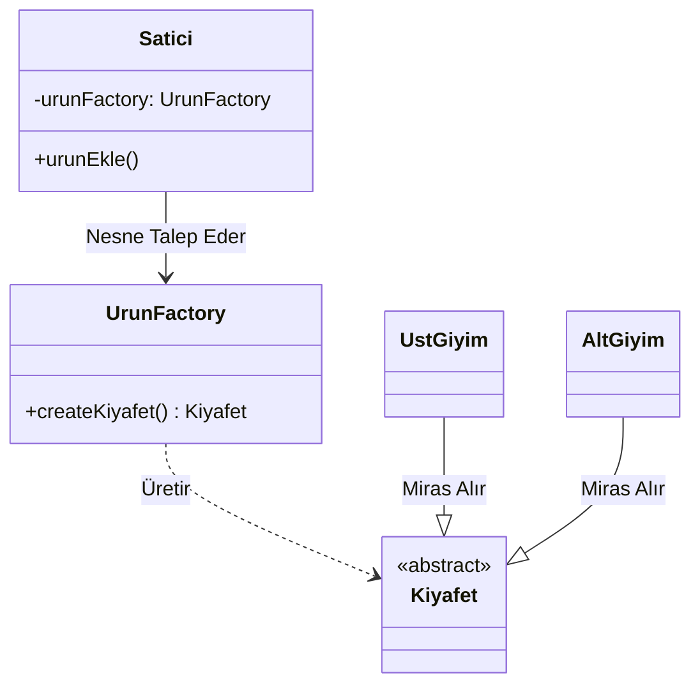
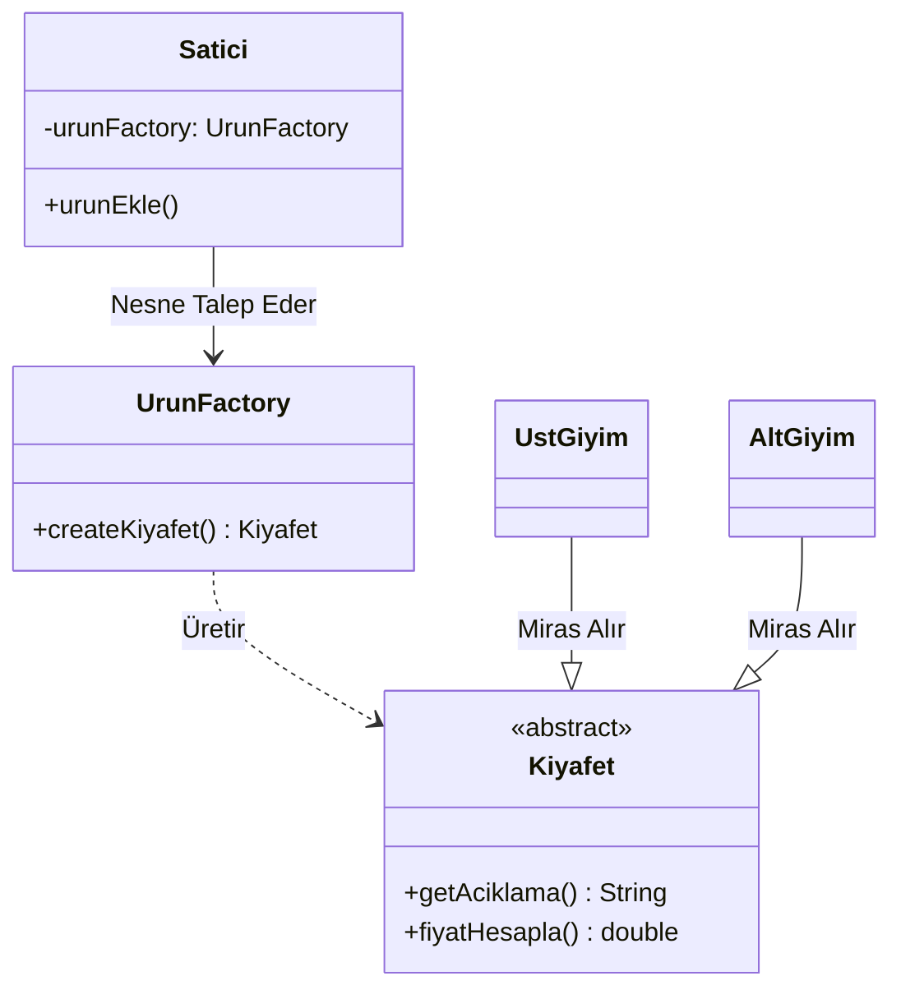
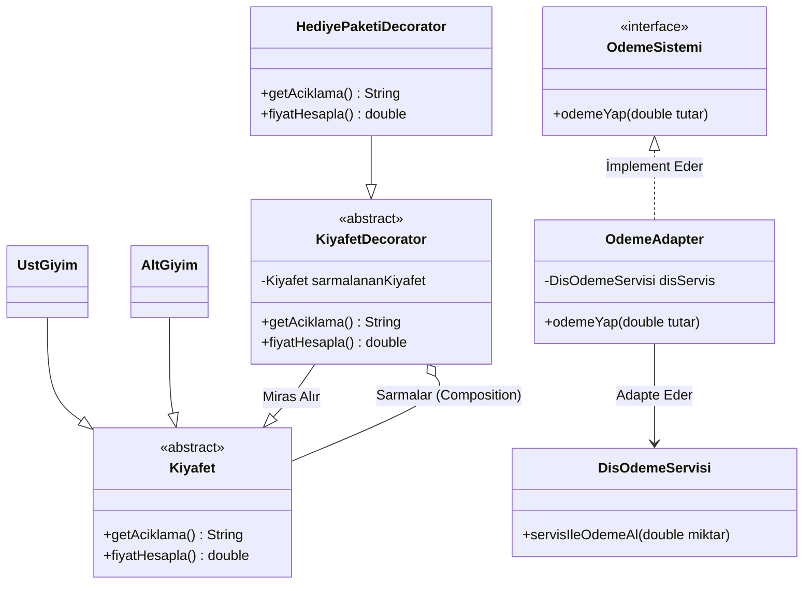
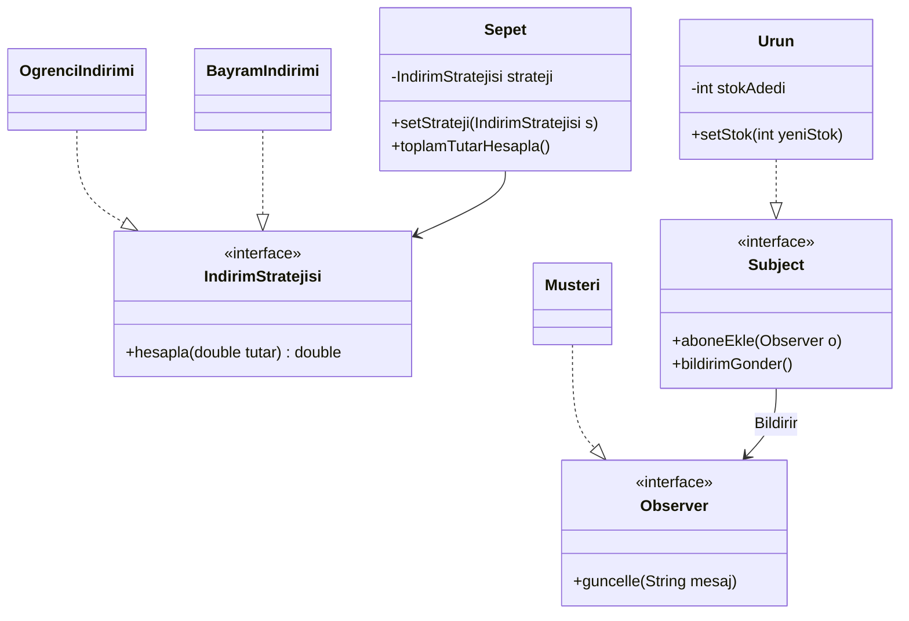
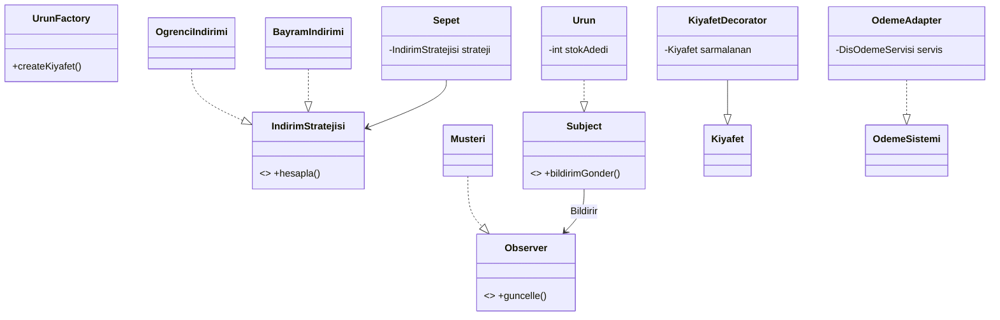

# Tasarım Örüntüleri Uygulama Günlüğü

Bu dosya, projenin ilerleyen fazlarında sisteme dahil edilecek olan tasarım örüntülerinin seçim gerekçelerini ve uygulama detaylarını içermektedir.

## Faz: 0
Şu anda herhangi bir tasarım örüntüsü kullanılmamıştır. Sistem "Spaghetti Code" yapısında, tüm mantığın tek bir sınıf ve metod içinde toplandığı bir haldedir.

## 1. Nesne Oluşturma Örüntüleri (Creational Patterns)
*  **Hedef:** İndirim stratejilerini veya farklı ürün tiplerini oluştururken esneklik sağlamak.
## 2. Yapısal Örüntüler (Structural Patterns)
*  **Hedef:** Farklı indirim türlerini veya ek hizmetleri (kargo, hediye paketi vb.) ana kodu bozmadan birbirine eklemek.
## 3. Davranışsal Örüntüler (Behavioral Patterns)
*  **Hedef:** Sepetteki indirim hesaplama mantığını (Strategy Pattern gibi) dinamik hale getirmek ve if-else yığınlarından kurtulmak.

## Faz: 1 - Factory Method Örüntüsü

#### 1. Nerede Kullandım?
Bu örüntüyü sistemin ürün oluşturma (nesne yaratma) aşamasında uyguladım. Satici sınıfı içinde bulunan ve doğrudan nesne üreten mantığı, yeni oluşturduğum UrunFactory sınıfına taşıyarak merkezi bir üretim noktası oluşturdum.

#### 2. Neden Kullandım?
Faz 0'da Satici sınıfı, UstGiyim ve AltGiyim gibi somut sınıflara doğrudan bağlıydı (**Tight Coupling**). Bu durum, her yeni ürün tipi eklendiğinde Satici sınıfının kodunu değiştirmeyi zorunlu kılıyordu. Nesne yaratma sorumluluğunu bir fabrikaya devrederek sınıflar arası bağımlılığı azaltmak ve sistemi genişletilebilir hale getirmek için bu örüntüyü seçtim.

#### 3. Ne Kazandım?
* **Gevşek Bağlılık (Loose Coupling):** Satici ve ShoppingCart sınıfları artık ürünlerin nasıl yaratıldığıyla ilgilenmiyor, sadece fabrikadan ürün talep ediyor.
* **Polimorfizm:** Tüm ürünler Kiyafet üst sınıfı üzerinden işleme alınarak kodun esnekliği artırıldı.
* **Bakım Kolaylığı:** Ürün oluşturma mantığında yapılacak bir değişiklik artık tüm sınıflarda değil, sadece UrunFactory içinde tek bir noktada yapılmaktadır.

---

### Önce/Sonra UML Sınıf Diyagramı

### Faz 0 (Öncesi) :

### Faz 1 (Sonrası) :


### **Faz 2: Structural Patterns (Yapısal Örüntüler)**

Bu aşamada, mevcut sınıfların yapısını bozmadan sisteme yeni yetenekler ve dış servisler kazandırmak amacıyla iki farklı yapısal örüntü kullanılmıştır.

#### **1. Decorator Pattern (Süsleyici Örüntüsü)**
* **Kullanım Amacı:** Ürün sınıflarının (Kıyafet, Pantolon vb.) koduna müdahale etmeden, çalışma anında bu ürünlere "Hediye Paketi" gibi opsiyonel özellikler ve ek maliyetler eklemek.
* **Neden Tercih Edildi?** Her özellik kombinasyonu için ayrı alt sınıflar oluşturup "Sınıf Patlaması" (Class Explosion) yaratmak yerine, mevcut nesneyi sarmalayarak (wrapping) esnek bir yapı kurulmuştur.
* **Uygulama:** KiyafetDecorator soyut sınıfı üzerinden türetilen HediyePaketiDecorator sınıfı, orijinal kıyafet nesnesini içinde tutarak hem fiyatı hem de açıklamayı dinamik olarak genişletir.


#### **2. Adapter Pattern (Adaptör Örüntüsü)**
* **Kullanım Amacı:** Projeye dahil edilen harici DisOdemeServisi'nin metod isimlerini, mevcut ödeme sistemimizle (odemeYap() metodu) konuşabilir hale getirmek.
* **Neden Tercih Edildi?** Dışarıdan gelen servis koduna müdahale edilemediği durumlarda, mevcut sistemdeki arayüzleri bozmadan uyum sağlamanın en güvenli yolu olduğu için seçilmiştir.
* **Uygulama:** OdemeAdapter sınıfı, dış servisin servisIleOdemeAl() metodunu sarmalayarak sistemimizin beklediği arayüz üzerinden çalışmasını sağlar.

### **UML Diyagramı Güncellemesi**

### Faz 1 (Öncesi) :

### Faz 2 (Sonrası) :


### **Faz 3: Behavioral Patterns (Davranışsal Örüntüler)**

Projenin final aşamasında, sistemin çalışma anındaki kararlarını esnek hale getirmek ve nesneler arası iletişimi otomatize etmek amacıyla iki davranışsal örüntü sisteme entegre edilmiştir.

#### **1. Strategy Pattern (Strateji Örüntüsü)**
* **Kullanım Amacı:** Sepetteki indirim hesaplama mantığını (Öğrenci, Bayram, Sezon Sonu vb.) birbirinden ayırarak, çalışma anında (runtime) değiştirilebilir hale getirmek.
* **Neden Tercih Edildi?** Sürekli büyüyen if-else yığınlarını temizlemek ve her indirim türünü kendi sınıfına hapsederek projenin genişletilebilirliğini (**Open-Closed Principle**) artırmak için seçilmiştir.
* **Uygulama:** IndirimStratejisi arayüzü üzerinden türetilen farklı sınıflar, sepet tutarını kendi algoritmalarına göre hesaplar.

#### **2. Observer Pattern (Gözlemci Örüntüsü)**
* **Kullanım Amacı:** Bir ürünün stok durumu veya fiyatı değiştiğinde, o ürünü takip eden müşterilere otomatik bildirim gönderilmesini sağlamak.
* **Neden Tercih Edildi?** Nesneler arasındaki bağımlılığı (**tight coupling**) azaltarak, bir nesnedeki değişikliği ilgili diğer tüm nesnelere manuel müdahale olmadan duyurmak amacıyla tercih edilmiştir.
* **Uygulama:** Subject arayüzünü uygulayan ürün sınıfları, stok azaldığında kayıtlı Observer (Müşteri) nesnelerini otomatik olarak haberdar eder.

### **Faz 3 UML Sınıf Diyagramı**



## **## Proje Son Durum**

"Evrimleşen Sistem" projesi, başlangıçta monolitik ve karmaşık olan bir yapının, tasarım desenleri kullanılarak nasıl modüler, esnek ve sürdürülebilir bir mimariye dönüştürülebileceğini göstermektedir. Proje, her aşamada yeni bir tasarım örüntüsü eklenerek sistemin yeteneklerinin artırıldığı bir gelişim sürecini temsil eder.

### **Uygulanan Tasarım Örüntüleri**

1.  **Factory Method (Faz 1):** Ürün nesnelerinin yaratılma mantığını merkezi bir fabrikaya taşıyarak, sistemin yeni ürün tiplerine (Üst Giyim, Alt Giyim vb.) kolayca adapte olmasını sağladık.
2.  **Decorator (Faz 2):** Mevcut ürün sınıflarını bozmadan, çalışma anında ürünlere "Hediye Paketi" gibi ek özellikler ve maliyetler ekledik.
3.  **Adapter (Faz 2):** Harici ödeme servislerini (Iyzico, PayU vb.), sistemin mevcut ödeme arayüzüne uyumlu hale getirerek dış sistem bağımlılığını yönettik.
4.  **Strategy (Faz 3):** İndirim hesaplama mantığını (Öğrenci, Bayram, Sezon Sonu) dinamik hale getirerek, `if-else` kalabalığından kurtulduk.
5.  **Observer (Faz 3):** Stok durumlarındaki değişiklikleri ilgili kullanıcılara otomatik olarak bildiren bir abonelik mekanizması kurduk.

---

### **Final Mimari Diyagramı**


### **## Nasıl Çalıştırılır?**

Projeyi yerel bilgisayarınızda test etmek ve tasarım örüntülerinin çıktılarını gözlemlemek için aşağıdaki adımları izleyebilirsiniz:

1.  **Depoyu Klonlayın:**
    ```bash
    git clone [https://github.com/hilal-cam/evrimlesen-sistem.git](https://github.com/hilal-cam/evrimlesen-sistem.git)
    ```

2.  **IDE ile Açın:**
    Proje klasörünü **IntelliJ IDEA**, **Eclipse** veya **VS Code** üzerinden "Maven Project" olarak içe aktarın.

3.  **CI Kontrolü:**
    GitHub üzerindeki **Actions** sekmesine tıklayarak otomatik derleme sürecinin (Maven Build) başarısını teyit edebilirsiniz.

4.  **Uygulamayı Başlatın:**
    `src/main/java/Main.java` dosyasını bulun ve sağ tıklayarak **"Run"** komutunu seçin.

5.  **Konsol Çıktılarını İnceleyin:**
    Sistem; Ürün Fabrikası, Süsleme (Decorator), Adaptör, Strateji ve Gözlemci (Observer) örüntülerinin çalışma mantığını konsol ekranında adım adım simüle edecektir.
