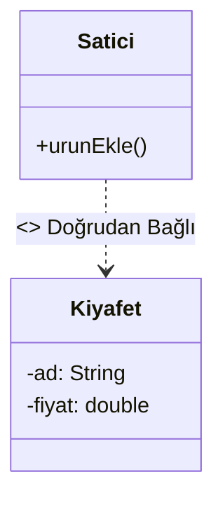

### Faz 0 UML Diyagramı:

```mermaid
classDiagram
    direction TB
    class Satici {
        +urunEkle()
    }
    class Kiyafet {
        -ad: String
        -fiyat: double
    }
    Satici ..> Kiyafet : <<new>> Doğrudan Bağlı
``` 
