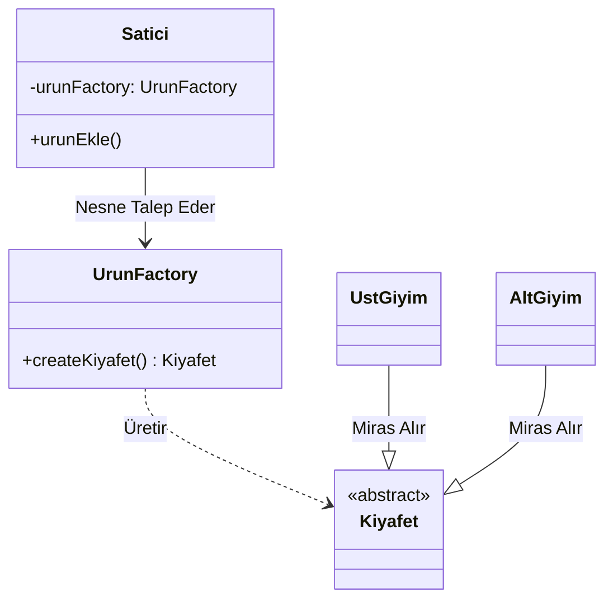

### Faz 1 UML Diyagramı:

```mermaid
classDiagram
    direction TB
    class Satici {
        -urunFactory: UrunFactory
        +urunEkle()
    }
    class UrunFactory {
        +createKiyafet() Kiyafet
    }
    class Kiyafet {
        <<abstract>>
    }
    class UstGiyim
    class AltGiyim

    Satici --> UrunFactory : Nesne Talep Eder
    UrunFactory ..> Kiyafet : Üretir
    UstGiyim --|> Kiyafet : Miras Alır
    AltGiyim --|> Kiyafet : Miras Alır
```

