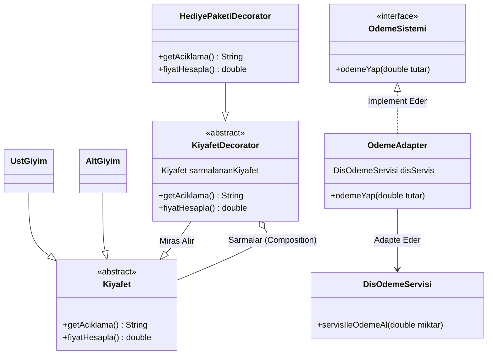

### Faz 2 UML Diyagramı :

```mermaid
classDiagram
    direction TB

    %% Faz 1'den Gelen Yapı
    class Kiyafet {
        <<abstract>>
        +getAciklama() String
        +fiyatHesapla() double
    }
    class UstGiyim
    class AltGiyim

    %% Decorator Yapısı (Yeni)
    class KiyafetDecorator {
        <<abstract>>
        -Kiyafet sarmalananKiyafet
        +getAciklama() String
        +fiyatHesapla() double
    }
    class HediyePaketiDecorator {
        +getAciklama() String
        +fiyatHesapla() double
    }

    %% Adapter Yapısı (Yeni)
    class OdemeSistemi {
        <<interface>>
        +odemeYap(double tutar)
    }
    class DisOdemeServisi {
        +servisIleOdemeAl(double miktar)
    }
    class OdemeAdapter {
        -DisOdemeServisi disServis
        +odemeYap(double tutar)
    }

    %% İlişkiler
    UstGiyim --|> Kiyafet
    AltGiyim --|> Kiyafet
    
    KiyafetDecorator --|> Kiyafet : Miras Alır
    KiyafetDecorator o-- Kiyafet : Sarmalar (Composition)
    HediyePaketiDecorator --|> KiyafetDecorator
    
    OdemeSistemi <|.. OdemeAdapter : İmplement Eder
    OdemeAdapter --> DisOdemeServisi : Adapte Eder
```
