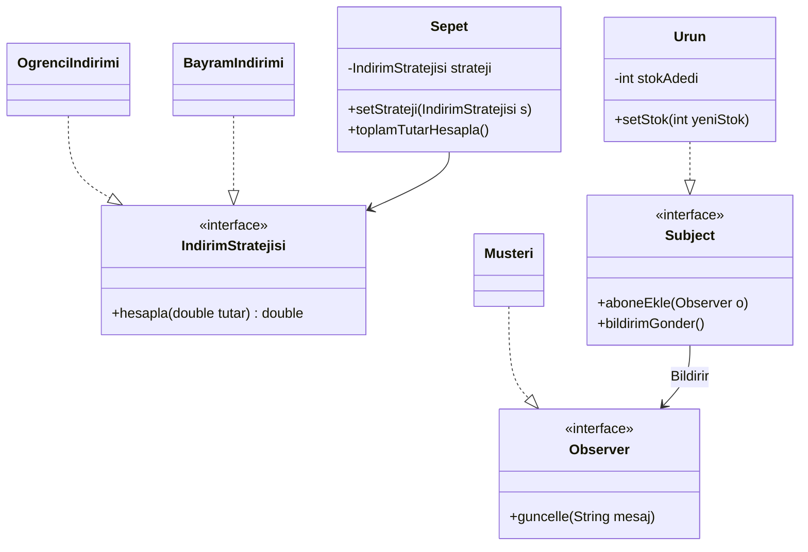

### **Faz 3 UML Sınıf Diyagramı**

```mermaid
classDiagram
    direction TB

    %% Faz 3: Strategy
    class IndirimStratejisi {
        <<interface>>
        +hesapla(double tutar) double
    }
    class OgrenciIndirimi
    class BayramIndirimi
    class Sepet {
        -IndirimStratejisi strateji
        +setStrateji(IndirimStratejisi s)
        +toplamTutarHesapla()
    }

    %% Faz 3: Observer
    class Subject {
        <<interface>>
        +aboneEkle(Observer o)
        +bildirimGonder()
    }
    class Urun {
        -int stokAdedi
        +setStok(int yeniStok)
    }
    class Observer {
        <<interface>>
        +guncelle(String mesaj)
    }
    class Musteri

    %% İlişkiler
    OgrenciIndirimi ..|> IndirimStratejisi
    BayramIndirimi ..|> IndirimStratejisi
    Sepet --> IndirimStratejisi
    
    Urun ..|> Subject
    Musteri ..|> Observer
    Subject --> Observer : Bildirir
```

